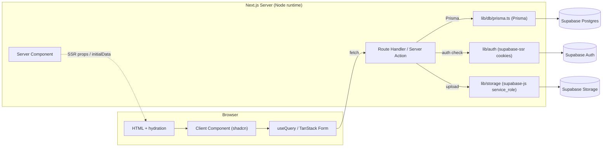

# Implementation Plan — Supabase + Prisma + TanStack + shadcn Stack

**Stack (decided):** Next.js 16.3.5 (App Router) + React 19 + TypeScript + Tailwind CSS v4 + shadcn/ui · **Supabase** (Postgres DB, Storage, Auth) · **Prisma** (ORM + migrations) · **TanStack Query** (data cache/SSR) · **TanStack Form** (admin forms + Zod).

## Goals & constraints
- Single-repo Next.js app (no separate backend). Public site + single-owner admin.
- Existing scaffold is `app/page.tsx`, `app/layout.tsx`, `app/globals.css`; no `components/`, `lib/`, or backend yet.
- Phases 1–4 use the temporary typed data at `lib/data/index.ts`; Phase 5 swaps to Prisma/Supabase.
- **No analytics** (decided previously): no `lib/analytics`, no `/admin/analytics`, no visitor tracking. Dashboard keeps 9 content/message stat cards plus two content-metric widgets (top-pages bar, downloads area).

## Resolved decisions

| Decision | Choice | Rationale / risk |
|---|---|---|
| DB engine | Supabase Postgres (hosted) | Already created by the owner; Prisma connects over its pooler URL. |
| DB connection | Supabase **connection pooler** URL (`*.pooler.supabase.co:5432`), not the direct `DATABASE_URL` | Serverless/edge-safe; direct connection exhausts pools under concurrent requests. |
| ORM + schema owner | Prisma + Prisma Migrate (`prisma/schema.prisma`) | Single source of truth vs. Supabase SQL UI → avoids drift. **Assumption:** DB is empty. If tables already exist, switch to `prisma db pull` introspection (branch below). |
| Auth (credentials/sessions) | Supabase Auth (email/password) + `@supabase/ssr` cookies | Single-owner; built-in brute-force protection, session expiry, logout. |
| Auth (authorization gate) | `@supabase/ssr` `getUser()` in middleware + each admin route handler | Supabase Auth owns the session; Prisma never sees auth state. |
| Data layer / trust boundary | Prisma connects as the DB **owner role** (full control over content schema) | Single-owner app: server-side trust boundary is sufficient; **no RLS** on content tables. Prisma owns Profile, Experience, Education, Skill, Achievement, Certificate, Project, Paper, eBook, Message, SEO, MediaAsset, ResumeConfig, nav/footer, etc. |
| Auth/Data split (no duplication) | `profiles` table (Prisma) FK → `auth.users.id`; Prisma never manages credentials | Prevents Sync-of-auth drift. `auth.users` is read-only via the FK; owned solely by Supabase Auth. |
| Storage | Supabase Storage (buckets: images, documents) via server-only `@supabase/supabase-js` (service_role) | Prisma can't upload files → storage behind a server Route Handler; only safe URLs persist in Postgres. |
| Public reads | Server Components → Prisma directly, ISR via `revalidate` | SSR/ISR at request time; no client cache needed for public pages; mutations revalidate. |
| Admin reads (interactive) | Route Handlers (`GET`) → TanStack Query `useQuery`, hydrated with server `initialData` | Client-side filtering/sorting/search need a cache; `initialData` keeps SSR fast. |
| Admin writes | TanStack Form (Zod) → TanStack Query `useMutation` → Route Handler → Prisma → `revalidatePath` | **One write path** (no Server-Action/Route-Handler duplication, per AGENTS.md). TQR is the unified admin data layer for reads + writes. |
| Auth writes (login/logout) | Server Actions (`app/api/auth/*`) | Form-action semantics fit login; keeps auth out of the admin TQR layer. |
| Prisma client lifecycle | Global singleton (`globalThis.prisma`) + `serverExternalPackages: ['@prisma/client']` | Avoids connection-pool exhaustion across serverless invocations. |
| Runtime | Node.js server runtime (NOT Edge) | Prisma client requires Node; set per-route runtime if needed. |
| Env exposure | Server-only: `DATABASE_URL` (pooler), `SUPABASE_URL`, `SUPABASE_SERVICE_ROLE_KEY`, `NEXTAUTH_SECRET`. Client-safe: none (auth/storage via server handlers). | Service-role key + DB connection must never reach the browser. |

## Data flow



SSR notes:
- Public pages: Server Components read via Prisma → render HTML → no client cache. Client interactivity (tabs/accordions/search) is local `useState`.
- Admin pages: Server Action/Route Handler returns data; wrap client component in `QueryClientProvider`; hydrate with `initialData` (from a server-side `use`d promise) or `dehydrate`.

## Migration branches
- **Default (DB empty):** `prisma migrate dev` creates schema from `schema.prisma`; `prisma db seed` runs `prisma/seed.ts`.
- **Branch (DB has existing tables):** `npx prisma db pull` → reconcile to `schema.prisma` → add named migration for any drift → seed idempotent (upsert). Document the chosen path in `lib/db/prisma.ts` header.

## Env & secrets
- `.env.local` (gitignored): `DATABASE_URL` (Supabase transaction pooler), `SUPABASE_URL`, `SUPABASE_SERVICE_ROLE_KEY`, `NEXTAUTH_SECRET`/`JWT_SECRET`.
- Never add `SERVICE_ROLE_KEY` to any client bundle. Public reads need no anon key because server-only Prisma handles them.

## Folder mapping (extends `docs/architecture.md` §5.3 — reconcile below)
```text
lib/
├── data/        # typed selectors + Prisma-backed reads; Phase 1-4 uses lib/data/index.ts (temporary)
├── api/         # TanStack Query fetcher helpers + shared Zod schemas (types shared with Prisma models)
├── auth/        # @supabase/ssr cookie helpers, auth guard, server-only session
├── db/          # prisma.ts (Prisma client, server-only) + migrations under prisma/
├── storage/     # supabase-js server client (service_role) + upload/validate helpers
├── resume/
└── components/
    ├── ui/      # shadcn components (install per docs/design.md)
    ├── portfolio/
    └── admin/
```
Route handlers remain under `app/api/` (auth/login, auth/logout, contact, admin/*/route.ts, media, resume/export).

## Doc drift to reconcile (post-phase-1 task)
The earlier docs edits state data access uses a Supabase client in `lib/db/supabase.ts`. With Prisma as the data layer, update `docs/architecture.md` §7.3 and `docs/memory.md` so:
- `lib/db/prisma.ts` is the content data client (Prisma).
- `lib/db/supabase.ts` (server-only) is used **only** for Auth + Storage, not content reads.

## Ordered tasks (stack-aligned to phases)

**Phase 0 — Stack alignment (new, pre-Phase 1)**
- [ ] Add deps: `prisma @prisma/client`, `@supabase/supabase-js`, `@supabase/ssr`, `@tanstack/react-query`, `@tanstack/react-form`, `zod`, `zod-prisma` (or explicit types), `react-hook-form` not used. Confirm Node runtime (set `server: 'node'` runtime or avoid Edge).
- [ ] Create `prisma/schema.prisma`; run `prisma generate`.
- [ ] Confirm Supabase DB state → pick migration branch (default: empty → `prisma migrate dev`).
- [ ] Reconcile docs: data layer = Prisma; supabase-js = auth+storage only.

**Phase 1 — Foundation**
- [ ] Init shadcn (`npx shadcn@latest init`, Slate), install components list per `docs/design.md` §1.2.
- [ ] Keep `lib/data/index.ts` as the **temporary** typed seed (Phases 1–4); mark temporary in code/docs.
- [ ] Public/ admin route placeholders, light public layout + dark admin layout (`admin-theme` class on `<html>`).
- [ ] `QueryClientProvider` + `SupabaseProvider` wired in client providers for admin (Phase 5 surfaces them).

**Phase 2–3 — Public pages (Server Components + Prisma-ready selectors)**
- [ ] Build selectors in `lib/data/` against the typed seed now, typed to match Prisma models so the Phase 5 swap is mechanical.
- [ ] Public pages read via Server Components; client interactivity via local state (no TQR yet for reads).
- [ ] Contact form UI (validation only; POST endpoint wired in Phase 6).

**Phase 4 — Resume**
- [ ] Resume config drives variants; PDF via print CSS (P0) or server-side render later.
- [ ] No analytics stat; downloads area chart on dashboard comes later.

**Phase 5 — Backend & Admin Core (stack-specific)**
- [ ] `prisma/seed.ts` from `lib/data/index.ts`; `prisma db seed`.
- [ ] `lib/db/prisma.ts` (server-only Prisma client, global singleton); `next.config.ts` exports `@prisma/client` as server external package; confirm DB uses the Supabase **pooler** URL and is server-only.
- [ ] `lib/auth` using `@supabase/ssr` (login/logout/session, cookie-based); admin route guard redirects unauthed to `/admin/login`.
- [ ] Auth endpoints: `app/api/auth/login/route.ts` (Server Action form), `logout/route.ts`, `session/route.ts`. **Login/logout are Server Actions; all other admin writes are Route Handlers** (avoids the Server-Action/Route-Handler duplication anti-pattern in AGENTS.md).
- [ ] Public pages: replace direct `lib/data` imports with Prisma-backed selectors (server-side, ISR); loading/error states.
- [ ] **Dashboard:** 9 stat cards + bar chart (top pages) + area chart (downloads); wrapped in `QueryClientProvider`; `useQuery` hydrated with server `initialData`; shadcn chart via Recharts. "Visitors" stat card removed (no analytics).
- [ ] `app/api/admin/*/route.ts` (CRUD) for: profile, experience, education, skills, achievements, certificates(pro+acad), projects, publications, research papers, ebooks. Admin writes use TanStack Form (Zod) → `useMutation` → Route Handler → Prisma.
- [ ] Mutations `revalidatePath` the affected public routes (and `revalidateTag` for shared collections).

**Phase 6 — Advanced Admin**
- [ ] Research profile/interests/upcoming/working CRUD (TanStack Form + Zod → `useMutation` → Route Handler → Prisma → revalidate).
- [ ] Contact pipeline: `app/api/contact/route.ts` → Prisma `Message` → admin inbox → email notify. Honeypot + rate limit.
- [ ] Resume editors (4) with TTR Form; connect configs to public Resume Center.
- [ ] Portfolio gallery/categories; website editors (home/about/nav/footer); persist → revalidate.
- [ ] SEO per-page metadata via generated `generateMetadata` from Prisma `seo` table; `sitemap.xml`/`robots.txt` route handlers.
- [ ] Media Library: `app/api/media/route.ts` → Supabase Storage (service_role) → `MediaAsset` row in Prisma. Type/size validation.
- [ ] Settings: profile quick-edit, 4 notification toggles, password change (Supabase Auth), double-confirm account delete.
- [ ] **Removed:** no `/admin/analytics`, no `lib/analytics`, no `/api/analytics`.

**Phase 7 — Hardening**
- [ ] Node runtime (not Edge) confirmed; CSRF (via SameSite cookies), XSS (escaped SSR), secure headers.
- [ ] `npm run lint && npm run build && npx tsc --noEmit` must pass.
- [ ] 360 px + desktop QA; keyboard/focus; `prefers-reduced-motion`.
- [ ] Prisma schema + seed idempotent; verify no data loss vs. seed.

## Validation
- `npx tsc --noEmit` clean; `npm run lint` clean; `npm run build` passes (Node runtime).
- Local: login → create/edit each entity → refresh public page reflects change (revalidate TTL).
- Invalid `/certificates/[id]` / `/portfolio/[id]` / `/research/[id]` → `not-found.tsx`.
- Dashboard: 9 stat cards + top-pages bar + downloads area render; no Visitors card.
- Media upload → stored in Supabase Storage bucket; only URL persisted in Postgres.
- No `SERVICE_ROLE_KEY` or `DATABASE_URL` in any client bundle (grep check).

## Assumptions / open items
- **Resolved (decided):** No analytics. No `/admin/analytics`, no `/api/analytics`, no `lib/analytics`, no visitor/page-view tracking. Dashboard = 9 content/message stat cards + two content-metric widgets (top-pages bar, downloads area).
- **Resolved (decided):** Auth/data split — Supabase Auth owns credentials/sessions; Prisma owns all content incl. `profiles` (FK → `auth.users.id`); Prisma connects as DB owner (no RLS on single-owner content).
- **Resolved (decided):** Admin writes = Route Handlers + `useMutation` (no Server-Action/Route-Handler duplication); auth login/logout = Server Actions.
- **Resolved (decided):** Public reads = Server Components + Prisma (ISR); admin reads = Route Handlers + `useQuery` hydrated via `initialData`; Prisma client = global singleton; deploy on Node runtime (not Edge); DB via Supabase pooler URL; server-only env split.

- **Open (keystone — blocks Phase 5 setup):** Is the Supabase Postgres database empty (no existing tables/schema), or does it already contain data/tables? Default = empty → Prisma Migrate creates the schema from `prisma/schema.prisma`; `prisma db seed` upserts the seed. If the DB already has tables, switch to `prisma db pull` introspection + a reconcile migration. **Provide credentials + DB state before Phase 5.**
- Shadcn install and theme wiring follow `docs/design.md` (adapt Vite `src/index.css` → `app/globals.css`).
- Admin owner account creation: recommended one-off setup script using the Supabase Admin API (service_role) to provision the auth user + `profiles` row; overridable via the Supabase dashboard. Confirm preferred method.
- Email delivery provider for contact notifications chosen in Phase 6 (not in scope here).
