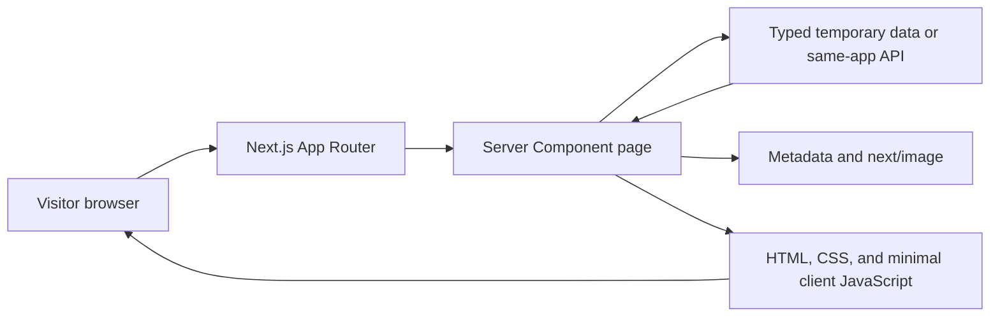
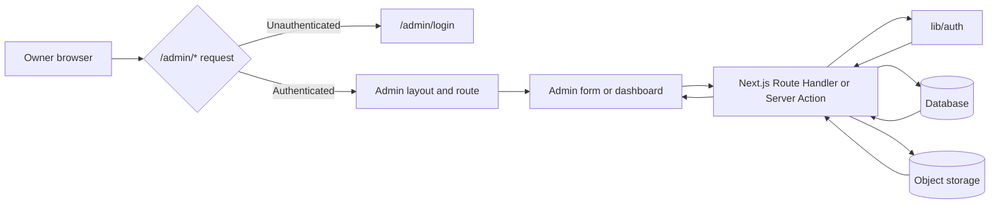
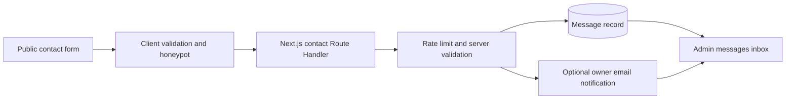
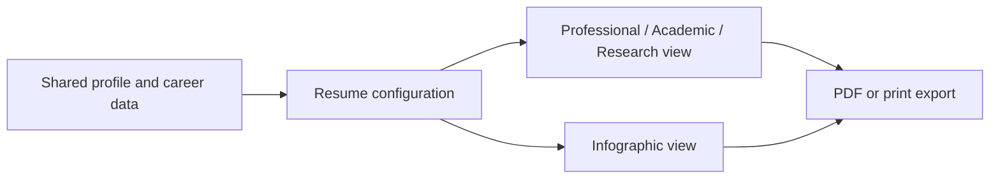

# Project Architecture

## 1. Purpose and status

This document defines the architecture for the Siddique academic and professional portfolio. It is the technical reference for the public portfolio, the single-owner admin CMS, the full-stack application boundary, the data lifecycle, and the phased migration from a static scaffold to a persistent product.

This is a **full-stack Next.js project**. The public site, admin UI, server-side business logic, authentication, API endpoints, data access, and deployment unit live in the same Next.js application and repository. A database, object storage, email provider, or analytics service may be external dependencies, but they are not a separate frontend/backend codebase.

The repository currently contains a minimal Next.js App Router scaffold. The architecture below distinguishes the current baseline from the target structure so that future work does not assume that the backend, database, authentication, or UI component library already exists.

## 2. Architectural principles

- Use the existing root-level Next.js App Router structure under `app/`; do not introduce `src/`, Pages Router files, React Router, Vite, Express, or a second routing system unless the user explicitly requests a migration.
- Keep the frontend and backend in one Next.js application. Do not create a separate API repository or service for the Phase 5 backend.
- Prefer Server Components for public content, metadata, and initial data access. Use Client Components only for browser state, forms, filters, accordions, dialogs, and other interactions.
- Use Next.js Route Handlers for explicit REST-style endpoints and Server Actions for page-bound form mutations when that model is clearer. Do not implement the same operation through both without a documented reason.
- Keep presentation, data access, domain logic, authentication, and persistence in separate layers.
- Maintain one source of truth for profile, career, research, portfolio, resume, website, SEO, media, and analytics data.
- Keep public reads separate from protected admin writes.
- Build in the order defined by `docs/phases.md`; do not implement Phase 5 persistence or Phase 6 admin modules before their prerequisites exist.
- Treat `P0` requirements as launch-critical, `P1` as required after the core flow, and `P2` as future work.
- Use semantic HTML, keyboard navigation, visible focus states, meaningful image alternatives, and `prefers-reduced-motion` support.
- Keep the public experience responsive at 360 px without horizontal scrolling.
- Once the full-stack runtime is active, deploy the application with a Next.js server or serverless runtime. A static-only export is not suitable for authenticated API routes, database access, or server-side mutations.

## 3. System architecture

### 3.1 Current baseline

The checked-in application is a single Next.js application with:

- `app/layout.tsx` as the root layout.
- `app/page.tsx` as the current home route.
- `app/globals.css` as the global Tailwind CSS entry point.
- `public/` for static assets.
- Root configuration files for TypeScript, ESLint, Next.js, PostCSS, and dependencies.
- No `src/` directory.
- No backend implementation, database client, authentication system, media storage, analytics service, or configured test framework yet.
- No `components/` or `lib/` directories yet.

The PRD refers to a typed seed-data file at `src/data/index.ts`, but that file is not present. Do not import it or describe it as implemented. A temporary typed data layer may be created during Phases 1–4 at an agreed repository path; the recommended path for this repository is `lib/data/index.ts`.

### 3.2 Full-stack target architecture

| Layer | Responsibility | Primary location |
| --- | --- | --- |
| Routing and page composition | URLs, layouts, route groups, metadata, loading/error/not-found states | `app/` |
| Public presentation | Portfolio pages, shared navigation, footer, cards, filters, resume views | `components/portfolio/` and route-local components |
| Admin presentation | Login, dashboard, CRUD forms, media picker, settings, analytics views | `components/admin/` |
| Shared UI | Reusable buttons, cards, badges, tabs, dialogs, tables, and layout primitives | `components/ui/` when shadcn is initialized |
| Application API | REST-style endpoints, request validation, authorization, response contracts | `app/api/.../route.ts` |
| Server mutations | Page-bound form actions, cache invalidation, redirects, and server-side validation | `app/.../actions.ts` or `lib/actions/` |
| Data access | Typed selectors, temporary seed data, API calls, caching, response contracts | `lib/data/` and `lib/api/` |
| Authentication and authorization | Session checks, admin route protection, password handling, logout | `lib/auth/` and protected route handlers |
| Database access | Schema queries, transactions, migrations, and persistence adapters | `lib/db/` |
| Media storage | Upload handling, object storage adapters, file metadata | `lib/storage/` |
| Resume logic | Resume configuration, variant selection, export preparation | `lib/resume/` |
| Analytics | Anonymous event ingestion and read models | `lib/analytics/` |
| External integrations | Email delivery, optional PDF rendering, optional analytics provider | Bounded adapters behind `lib/` |

The layers should depend inward: pages and components call typed data-access functions; data-access functions call API, database, or storage adapters; persistence and external services never import UI components.

### 3.3 API design

- Put API endpoints under `app/api/`; their public URLs are `/api/...`.
- Use `GET` for public reads and authenticated reads, and `POST`, `PUT`, `PATCH`, or `DELETE` for protected mutations.
- Keep route handlers thin: authenticate, validate the request, call a server-only service or data-access function, and return a typed response.
- Keep database queries, transactions, and provider-specific code behind `lib/db/`.
- Keep media upload and object-storage code behind `lib/storage/`.
- Do not expose database records, credentials, private environment variables, or raw error details to the browser.
- Use a consistent error envelope and HTTP status codes across endpoints.
- A Route Handler and a page cannot occupy the same route segment. Keep API routes under the dedicated `app/api/` tree.

## 4. Application flow

### 4.1 Public visitor flow



1. The browser requests a public URL such as `/research` or `/certificates/[id]`.
2. The App Router resolves the route group, dynamic segment, and page file.
3. A Server Component loads page data through the data-access layer.
4. During Phases 1–4, the data source may be typed temporary data. During Phase 5 and later, it should read through the same application's typed API or server-only data layer.
5. The page renders shared public layout elements, route content, metadata, and optimized images.
6. Client interactivity is limited to controls that require browser state, such as filters, tabs, accordions, search, and copy actions.

### 4.2 Admin flow



1. The owner opens `/admin/login` and submits credentials.
2. The authentication layer validates the credentials, creates a server-side session, and applies expiry and brute-force protection.
3. Every `/admin/*` route checks authentication before rendering protected content.
4. Admin forms validate input on the client and again in the server action or Route Handler.
5. Protected mutations persist content, configuration, messages, media metadata, SEO records, or analytics settings.
6. Successful mutations invalidate or revalidate the affected public reads so changes appear after refresh or within the documented cache TTL.
7. Destructive actions require a separate confirmation step.

### 4.3 Contact flow



The contact form must not write directly to the database from the browser. The Next.js server endpoint is responsible for validation, sanitization, spam protection, persistence, and optional email delivery.

### 4.4 Resume flow



All resume variants consume the same underlying content. `ResumeConfig` controls visibility, counts, accent color, typography, and custom notes. The export implementation must be selected deliberately: client print CSS or a server-side headless-browser renderer.

## 5. Route and folder structure

### 5.1 Current structure

```text
siddique-portfolio/
├── app/
│   ├── layout.tsx
│   ├── page.tsx
│   └── globals.css
├── docs/
│   ├── PRD.md
│   ├── phases.md
│   ├── design.md
│   ├── architecture.md
│   ├── rules.md
│   └── memory.md
├── public/
├── package.json
├── package-lock.json
├── next.config.ts
├── eslint.config.mjs
├── postcss.config.mjs
├── tsconfig.json
└── CLAUDE.md
```

### 5.2 Target application structure

Route groups are organizational only and do not change the public URLs.

```text
app/
├── layout.tsx
├── page.tsx
├── globals.css
├── not-found.tsx
├── api/
│   ├── auth/
│   │   ├── login/route.ts
│   │   ├── logout/route.ts
│   │   └── session/route.ts
│   ├── contact/route.ts
│   ├── admin/
│   │   └── .../route.ts
│   ├── media/route.ts
│   ├── analytics/route.ts
│   └── resume/export/route.ts
├── (public)/
│   ├── page.tsx
│   ├── about/page.tsx
│   ├── experience/page.tsx
│   ├── education/page.tsx
│   ├── skills/page.tsx
│   ├── achievements/page.tsx
│   ├── certificates/page.tsx
│   ├── certificates/[id]/page.tsx
│   ├── portfolio/page.tsx
│   ├── portfolio/[id]/page.tsx
│   ├── research/page.tsx
│   ├── research/[id]/page.tsx
│   ├── research/upcoming/page.tsx
│   ├── publications/page.tsx
│   ├── ebooks/page.tsx
│   ├── ebooks/[id]/page.tsx
│   ├── resume/page.tsx
│   ├── resume/infographic/page.tsx
│   └── contact/page.tsx
└── (admin)/
    ├── admin/login/page.tsx
    ├── admin/page.tsx
    ├── admin/profile/page.tsx
    ├── admin/experience/page.tsx
    ├── admin/education/page.tsx
    ├── admin/skills/page.tsx
    ├── admin/achievements/page.tsx
    ├── admin/certificates/professional/page.tsx
    ├── admin/certificates/academic/page.tsx
    ├── admin/projects/page.tsx
    ├── admin/publications/page.tsx
    ├── admin/research/papers/page.tsx
    ├── admin/research/profile/page.tsx
    ├── admin/research/interests/page.tsx
    ├── admin/research/upcoming/page.tsx
    ├── admin/research/working/page.tsx
    ├── admin/ebooks/page.tsx
    ├── admin/messages/page.tsx
    ├── admin/analytics/page.tsx
    ├── admin/resume/professional/page.tsx
    ├── admin/resume/academic/page.tsx
    ├── admin/resume/research/page.tsx
    ├── admin/resume/infographic/page.tsx
    ├── admin/portfolio/gallery/page.tsx
    ├── admin/portfolio/categories/page.tsx
    ├── admin/website/home/page.tsx
    ├── admin/website/about/page.tsx
    ├── admin/website/navigation/page.tsx
    ├── admin/website/footer/page.tsx
    ├── admin/seo/page.tsx
    ├── admin/media/page.tsx
    └── admin/settings/page.tsx
```

The `app/(public)` and `app/(admin)` groups may have separate layouts for the light public theme and dark admin theme. A route group must not be used to create a second routing system or to change the URLs in the PRD.

### 5.3 Shared code structure

```text
components/
├── ui/                              # shadcn components only after initialization
├── portfolio/                       # public portfolio primitives
└── admin/                           # admin shell, forms, tables, and dialogs

lib/
├── data/                            # entity types, selectors, temporary seed data
├── api/                             # typed API contracts and client helpers
├── auth/                            # session and authorization helpers
├── db/                              # database client, schema, migrations, repositories
├── storage/                         # media upload and object-storage adapters
├── resume/                          # resume configuration and export logic
└── analytics/                       # event contracts and read helpers

public/
├── images/
├── documents/
└── icons/

docs/
├── PRD.md
├── phases.md
├── design.md
├── architecture.md
├── rules.md
└── memory.md
```

Create these directories only when they contain code or assets. Do not create empty scaffolding merely to match the diagram.

## 6. Technology stack

### 6.1 Installed and active

| Area | Technology | Use |
| --- | --- | --- |
| Framework | Next.js `16.3.5` | App Router, Server Components, Route Handlers, server rendering, metadata, image optimization |
| UI runtime | React `19.2.8` and `react-dom` | Component rendering and client interactions |
| Language | TypeScript `5` | Strict application, API, and data contracts |
| Styling | Tailwind CSS `4` | Utility-first styling and design tokens |
| CSS processing | `@tailwindcss/postcss` | Tailwind processing for `app/globals.css` |
| Linting | ESLint `9` and `eslint-config-next` | Static checks and Next.js rules |
| Fonts | `next/font/google` with Geist and Geist Mono | Current scaffold font setup |
| Path alias | `@/*` | Imports rooted at the repository root |
| Package manager | npm | Dependency and script execution |

The current font setup is a scaffold decision, not a final brand decision. The design guide proposes a display, sans, and mono font system. Any replacement must use Next.js font optimization and must be resolved before it is applied globally.

### 6.2 Full-stack capabilities provided by Next.js

| Capability | Next.js mechanism |
| --- | --- |
| Server-rendered public pages | Server Components and App Router layouts/pages |
| API endpoints | `app/api/.../route.ts` Route Handlers |
| Server-side mutations | Server Actions or Route Handlers |
| Request and response handling | Web `Request`/`Response`, `NextRequest`, and `NextResponse` |
| Authentication boundaries | Server-only session checks in layouts, actions, and route handlers |
| Cache invalidation | `revalidatePath`, `revalidateTag`, `updateTag`, and route-level caching |
| Media handling | Server-side upload handlers backed by a storage adapter |
| PDF generation | Server-side rendering/print pipeline or client print CSS |
| SEO | Server Component metadata, generated metadata, sitemap, robots, and Open Graph routes/files |

### 6.3 Not currently installed

The repository does not currently include:

- shadcn/ui or `components/ui/`.
- A database client, ORM, database server, or migration tool.
- An authentication library or implemented session system.
- Form or schema-validation libraries.
- A charting library.
- Media upload or object-storage integration.
- Email delivery integration.
- A configured test framework or test command.

Do not claim these capabilities exist. Add them only when the relevant phase and user-approved architecture require them.

### 6.4 Phase-dependent choices

| Area | Allowed direction | Decision point |
| --- | --- | --- |
| Temporary data | Typed in-memory or seed-data module | Phase 1 |
| Backend surface | Next.js Route Handlers, Server Actions, or a documented combination | Phase 5 |
| **Database** | **Supabase Postgres (hosted)** — chosen | **Phase 5 — resolved** |
| **Media storage** | **Supabase Storage (S3-compatible)** — chosen | **Phase 5 — resolved** |
| **Admin authentication** | **Supabase Auth (email/password + server-side sessions)** — chosen | **Phase 5 — resolved** |
| Charts | A maintained React chart library; Recharts is a PRD candidate | Phase 6 |
| Resume PDF | Client print CSS or server-side headless-browser rendering | Phase 4 |
| Email | Transactional email provider or equivalent adapter | Phase 6 |
| Analytics | First-party database events or a privacy-friendly provider | Phase 6 |

The backend surface, database, storage, and authentication choices are resolved for Phase 5: **Supabase** provides the database (Postgres), object storage, and authentication. Do not mix Supabase Postgres/Storage with an incompatible persistence system without a recorded reason.

## 7. Data architecture

### 7.1 Data ownership

The PRD entities are the domain model: Profile, Experience, Education, Skill, Achievement, Certificate, Project, ResearchPaper/Publication, UpcomingResearch, WorkingPaper, Language, eBook, Message, ResumeConfig, PortfolioCategory, navigation/footer/page configuration, SEOEntry, MediaAsset, AnalyticsEvent, and AdminUser.

Define TypeScript types before creating forms, API contracts, or database schemas. Keep identifiers stable and use explicit status values where the PRD defines them.

### 7.2 Temporary data phase

During Phases 1–4:

- Use a typed temporary data module under `lib/data/`.
- Keep selectors and derived values separate from page markup.
- Mark the data as temporary seed data in code and documentation.
- Do not present temporary data as persistent storage.
- Do not import the nonexistent `src/data/index.ts`.

### 7.3 Persistent data phase

During Phase 5 and later:

- The chosen persistence layer is **Supabase**: Supabase Postgres for data and Supabase Storage for media (S3-compatible). Keep the server-only client and all credentials in `lib/db/supabase.ts`; never expose the service-role key to the browser.
- Expose persistence through typed Route Handlers, Server Actions, or server-only data-access functions under `lib/data/` and `lib/storage/`.
- Keep public reads unauthenticated and protected writes authenticated.
- Validate and sanitize all write payloads on the server.
- Store media separately from content records via Supabase Storage and persist only safe metadata and URLs in Postgres.
- Use migrations and a seed process from `lib/data/index.ts` when replacing temporary data.
- Revalidate public reads (`revalidatePath`/`revalidateTag`) after admin mutations.
- Abstract Supabase access behind typed selectors so page components depend on the data-access layer, not on provider specifics directly.

## 8. Security boundaries

- `/admin/*` is a protected boundary. Unauthenticated visitors must be redirected to `/admin/login`.
- Authentication state and secrets remain server-side. Never expose private environment variables or credentials to client bundles; use `NEXT_PUBLIC_` only for values that are safe to expose.
- Passwords must be hashed, sessions must expire, logout must revoke the session, and repeated login failures must be rate-limited or locked out.
- Treat every Route Handler and Server Action as an untrusted entry point. Authenticate, authorize, validate, and sanitize inside the server boundary.
- Every admin mutation requires authorization and server-side validation.
- Contact submissions require honeypot and rate-limit protection; CAPTCHA is optional.
- File uploads require type, size, and content validation before storage.
- Destructive admin actions require two-step confirmation.
- Public pages should use safe rendering, sanitized rich content, and appropriate HTTP/security headers.
- HTTPS, CSRF/XSS protections, backups, monitoring, and secure headers are launch requirements.

## 9. Rendering, caching, and SEO

- Use Server Components and React Server Component metadata exports for public-page titles, descriptions, Open Graph data, canonical URLs, and structured data.
- Use `next/image` for local and remote portfolio imagery with meaningful alt text and explicit dimensions or a controlled `fill` layout.
- Use route-level loading, error, and not-found states where data or records can fail.
- Public reads may use documented time-based revalidation or CDN caching. Admin writes must call the appropriate cache invalidation mechanism after a successful mutation.
- Prefer tag-based revalidation for shared content collections and path-based revalidation when a single route is affected.
- Dynamic filters and tabs should use URL search parameters when the state must be refreshable or shareable.
- Keep the public light theme and dark navy hero sections. Keep the admin surface dark and separate.
- The design guide contains Vite and `src/index.css` references inherited from another project. For this repository, use `app/globals.css`, `@theme`/`@theme inline`, and the Next.js App Router conventions.

## 10. Phase alignment

| Phase | Architecture outcome |
| --- | --- |
| Phase 1 | App Router shell, route groups, design tokens, shared primitives, typed temporary data |
| Phase 2 | Public portfolio routes and shared public layout |
| Phase 3 | Research, publication, eBook, and dynamic detail routes |
| Phase 4 | Resume variants, shared resume configuration, and export boundary |
| Phase 5 | Same-app full-stack backend, database, authentication, protected API, admin shell, live public reads |
| Phase 6 | Advanced admin modules, media storage, contact pipeline, SEO, analytics, and settings |
| Phase 7 | Security, performance, accessibility, deployment, backups, and monitoring |

A phase is complete only when its implementation, acceptance criteria, and definition of done in `docs/phases.md` are verified.

## 11. Open architecture decisions

The following decisions remain open until the relevant phase:

1. Select the database and migration strategy. **Resolved:** Supabase Postgres (hosted), migrated from `lib/data/index.ts` seed data.
2. Select media/object storage and upload boundaries. **Resolved:** Supabase Storage (S3-compatible) buckets accessed through `lib/storage/`.
3. Select the authentication/session mechanism and password policy. **Resolved:** Supabase Auth (email/password + server-side sessions, built-in brute-force protection).
4. Confirm the final brand fonts and whether the current Geist setup remains.
5. Select the charting library for analytics.
6. Select the resume PDF rendering strategy.
7. Select the transactional email provider and analytics approach.

Record each decision in this file and, when requested by the user, in `docs/memory.md`.
